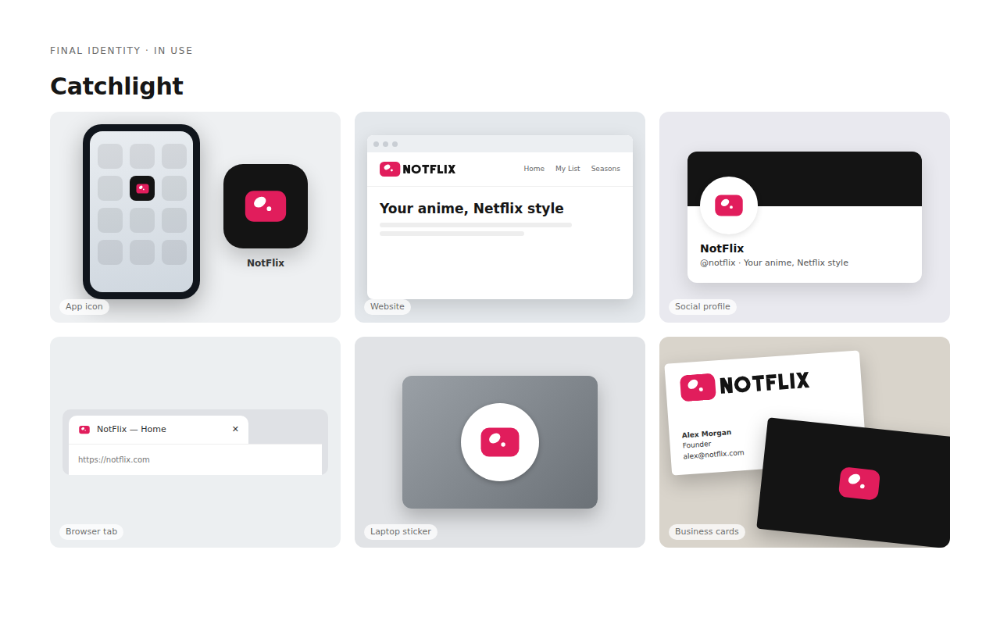

# NotFlix brand



**Catchlight**: a screen that looks back at you with an anime eye's catchlights. It says
"screen" and "anime" in one shape. There are no letters, no film strip and no ribbon "N": NotFlix
is its own thing, not a Netflix look-alike.

## Files

| Folder | What |
|---|---|
| `logo/` | SVG masters: the symbol, its small-size cut, the horizontal and stacked lockups, the wordmark, the app icon. Each comes in colour (on dark / on light), black and white |
| `web/` | favicon.ico (16/32/48), favicon.svg, apple-touch-icon, the PWA icons (192, 512, maskable) |
| `desktop/` | The desktop app's icon: icon.png (1024; electron-builder makes .icns from it), icon.ico |
| `board/` | Presentation board (`notflix-identity.html`, slides as PNG), and its spec |
| `build.py` | Draws every master from geometry, and syncs the logo into the apps |
| `export-icons.mjs` | Rasterises the icons, and copies them into the apps |

**Rebuilding.** After a change to the geometry or the colours, run:

```sh
python3 brand/build.py                # masters, frontend/src/lib/logo.ts, desktop/icons/notflix-horizontal.svg
node brand/export-icons.mjs           # PNG/ICO icons, copied to frontend/ and desktop/icons/
```

`export-icons.mjs` needs Playwright's Chromium (`npm i -g playwright && npx playwright install chromium`, then run
with `NODE_PATH=$(npm root -g)`).

## The mark

- **Construction.** On a 256 grid, the screen is a rounded rectangle 216 × 164 (radius 46: 16:12, softer than a
  TV). There are two catchlights. The large one is an oval (68 × 50, tilted −35°) in the upper left; the small one is
  a circle (Ø 24) down and to its right. Nothing else.
- **Small sizes.** Under 48 px, use the small cut (`notflix-symbol-small.svg`, `notflix-favicon.svg`). Its screen is
  fuller and its catchlights are bigger, so the small one doesn't vanish. The favicons and app icons are made from it.
- **Minimum size.** Symbol 16 px (small cut). Horizontal lockup 20 px high on screen, 8 mm in print.
- **Clear space.** Keep at least the large catchlight's height (a quarter of the screen's height) free around the logo.

## Colour

| | HEX | RGB | Use |
|---|---|---|---|
| **Catchlight Rose** | `#E11D5C` | 225 29 92 | The mark, buttons, highlights. White text on it: 4.6:1 (AA) |
| Rose dark | `#B0124A` | 176 18 74 | Hover and pressed states |
| **Ink** | `#141414` | 20 20 20 | Backgrounds; the wordmark on light; the app icon's tile |
| White | `#FFFFFF` | 255 255 255 | The catchlights; the wordmark on dark |

Print approximations (check with a proof): Rose ≈ CMYK 0 90 50 0, Pantone 192 C (closest); Ink ≈ CMYK 0 0 0 95.

- **On dark** (the app's own background): a Rose screen, white catchlights, and a white wordmark (`*-horizontal.svg`).
- **On light**: a Rose screen and an Ink wordmark (`*-on-light.svg`).
- **One colour**: all black, or all white on Rose or a photo. Here the catchlights are holes (`*-black.svg`, `*-white.svg`).

The app's designs recolour the mark (Settings → Design): the screen takes the design's brand colour, and the wordmark
the logo colour (gold in Communism, teal in Miku). That's allowed only there.

## Wordmark

NOTFLIX is constructed, not set in a font. It uses straight strokes 24 thick on a 96 cap height, a ring O with a
slight overshoot, and evenly gapped letters. Use the files; don't retype it. In the horizontal lockup, the wordmark
sits a third of its cap height to the right of the screen. It's centred on the screen's height.

## Don't

- Don't use Netflix red (`#E50914`), or put the mark in a red ribbon or an "N".
- Don't stretch it, rotate it, add outlines, shadows or gradients, or recolour the catchlights.
- Don't move, add or remove catchlights (the two are the logo).
- Don't put the colour mark on Rose or busy backgrounds: use the white one-colour version there.
- Don't use the regular symbol under 48 px: use the small cut.

The marks are original. Before registering one as a trademark, have it searched professionally.
